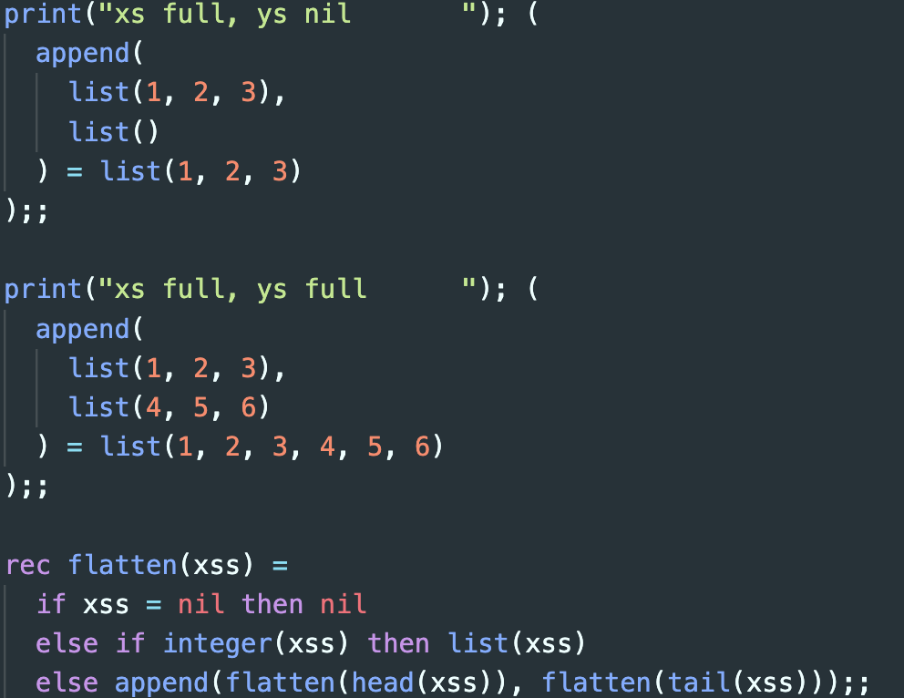
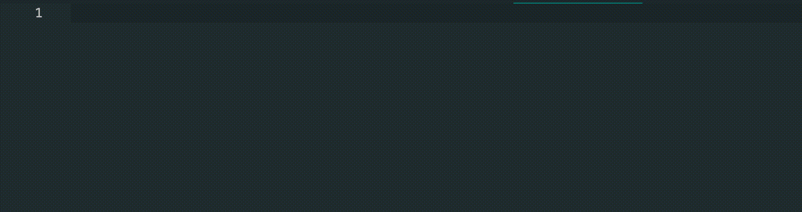

# fun-support README

Provides support for the `.fun` syntax language.

As far as I can tell, this language is only used as a toy language for the Oxford POPL
course... so maybe not useful to most people, but I got irritated at the lack of syntax
support.

## Features

Syntax highlighting:

Bracket completion:

## Known Issues

- Could have more applicable scopes, i.e. `expression.fun`, `assignment.fun`, ...
- Could properly label parameter variables

## Release Notes

Changelog [here](./CHANGELOG.md)
